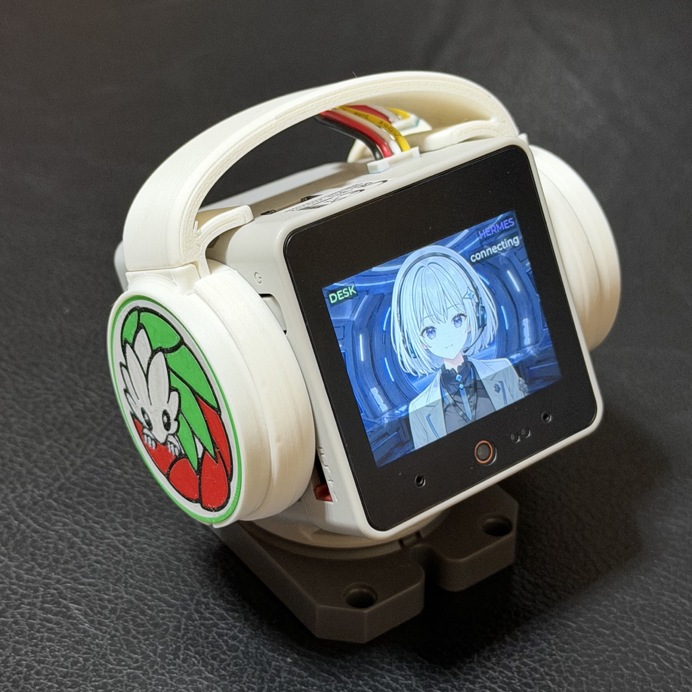

<!--
15分LT用スライド（Marp）。
レンダリング: npx @marp-team/marp-cli@latest slides/lt-stackchan-ai-agent.md -o out.pdf
（--pptx でPowerPoint、--html でHTML）。各スライドの <!-- --> はプレゼンター用メモ。
時間配分の目安は docs/lt.md を参照。
-->

<!-- _class: lead -->

# スタックチャンと AIエージェント

### 〜 自分で育てた"相棒"が物理世界に立つまで 〜

 

**AI Dev Day 2026 ｜ Lightning Talk**
大谷 / aieo

<!--
つかみ：「今日は、AIエージェントを"画面から出す"話をします」。
5歳の誕生日を迎えたスタックチャンと、実際にLLMで会話させて苦労した話。
-->

---

## このトークのゴール（15分）

- 🧸 **スタックチャンって何？**（知らない人が大多数、の前提で）
- 🗣️ **AIエージェントと"会話"するには？**（仕組みの全体像）
- ⚡ **実践の苦労＝レイテンシーとの戦い**（実開発の生々しい話）

 

> キーメッセージ：**育てたAIエージェントが、顔と声と体を持つと"相棒"になる**

<!--
自己紹介は一言。aieoでスタックチャン×Module-LLMを開発中。
「歴史 → 実践」の流れで話します、と地図を見せる。
-->

---

<!-- _class: section -->

# ① そもそも、 スタックチャンとは？

---

## スタックチャン＝カワイイOSSロボット

- **M5Stack** ベースの**手乗りサイズ**の卓上ロボット
- 首を振り・**表情**を出し・**しゃべる**
- **2021年** ししかわさん([@meganetaaan](https://x.com/meganetaaan))が公開
- **オープンソース** → 世界中が改造・着せ替え・AI化
- 2026年7月2日で **5歳のお誕生日** 🎂

<!--
「スーパーカワイイ手乗りロボット」。写真を見せて、まず"存在"を知ってもらう。
自作できる・安い・改造自由、が愛される理由。
-->

---

## なぜこんなに愛されるのか

- 💴 **安い・作れる・改造できる**（OSS＋M5Stack）
- 😊 **"顔"がある** → 道具ではなく"存在"として愛着がわく
- 🎉 **コミュニティ文化**：お誕生日会・着せ替え・撮影ブース

 

※ このブースも、コミュニティの着せ替え文化から生まれています

<!--
ブースの文脈にもつなぐ。着せ替え・撮影ブースはコミュニティ由来。
-->

---

<!-- _class: section -->

# ② スタックチャンの歴史 2021 → 2026、AIとの合流

---

## 歴史：カワイイロボット → 会話するAI

| 時期 | できごと |
|---|---|
| **2021** | 誕生。サーボ2個で首振り・M5Stackの"顔" |
| **2022–23** | コミュニティ拡大。**ChatGPT連携**で"しゃべる"化 |
| **2024–25** | LLM高性能化。**音声対話**が実用域に |
| **2026** | M5公式版 **スタックチャン(K151)** 発売 ／ **Module-LLM**（オンデバイスLLM）登場 |

 

→ いま：**クラウドAI × オンデバイスAI** の二刀流時代へ

<!--
歴史の山場は「AI連携で"ただのカワイイ置物"から"会話する相棒"に変わった」点。
2026にオンデバイスLLM(Module-LLM)が来て、ネット無しでも喋れる時代に。
-->

---

<!-- _class: section -->

# ③ なぜ"物理"なのか AIエージェントを画面から出す価値

---

## 育てたエージェントが"体"を持つと

**画面の中だけ**
- 便利な"道具"どまり
- 呼んでも"そこに居ない"

**顔・声・体を持つと**
- 呼べば**振り向く**
- そこに**"居る"**＝相棒
- 育てた記憶・性格が**物理世界に立つ**

 

AIエージェントを"育てた先"に見える、フィジカルな世界観

<!--
ブースのコンセプトそのもの。「自分で育てたAIエージェントが、物理的に呼び出せる」。
ここが今回一番伝えたい世界観。
-->

---

<!-- _class: section -->

# ④ AIエージェントと 会話するには？

---

## 会話の4ステップ

🎙️声 → ①聞く(STT) → ②考える(LLM) → ③話す(TTS) → 🔊声

- 各ステップを **どこで動かすか**（オンデバイス / クラウド）が勝負
- 速さ（オンデバイス）と 賢さ（クラウド）は **トレードオフ**
- この積み重ねが、そのまま **レイテンシー**（返事までの時間）になる

<!--
次の「苦労話」への伏線。4ステップ全部が遅延の積み上げ、と印象づける。
-->

---

## 我々の構成（aieo-stack-chan）

- 🧠 本体：**M5Stack CoreS3 + Module-LLM**（オンデバイスLLM / NPU）
- ☁️ 頭脳：Mac Studio 上の **Claude Agent SDK**
- 🗣️ 声：**VOICEVOX（満別花丸）** で日本語TTS
- 🌐 どこでも：**Tailscale Funnel** で 家 / テザリング / カフェ 同一URL
- 🚦 3モード：🟢**Full** / 🟡**Degraded**（オンデバイスのみ）/ 🔴**Offline**

 

GitHub: aieo-product/aieo-stack-chan

<!--
ハイブリッド構成。ネット状況で3モードに落ちる設計＝ブースの"ネットワーク懸念"への答えでもある。
-->

---

## 鍵は "tiered cognition"（段階的な思考）

- 🟢 **軽い応答・聞き取り**：本体内で完結（**速い**）
- ☁️ **深い思考**：クラウドの Claude（**賢い**）
- 🎭 **顔から声が出る**：入力＝Module-LLMのマイク／出力＝CoreS3のスピーカー

 

> 「速い脳」と「賢い脳」を**使い分ける**のが、自然な会話のコツ

<!--
tiered cognition＝人間も「えーっと（即答）」と「よく考えた答え」を使い分ける、の比喩で。
-->

---

<!-- _class: section -->

# ⑤ 実践の苦労 レイテンシーとの戦い ⚡ （ここからが本番）

---

## 問題："7秒の沈黙"

- 声をかけてから返事まで **7秒**
- 人は **2秒**黙られると「**壊れた?**」と感じる
- STT → LLM → TTS → 音声転送 の**往復が積み上がる**

 

| 区間 | 時間 |
|---|---|
| **Claude API（考える）** | **3–4秒** ← 最大のボトルネック |
| その他（聞く・話す・転送）| 3–4秒 |
| **合計** | **約7秒** |

<!--
実測。7秒の沈黙は会話として致命的。ボトルネックはクラウドLLMの往復。
以降、これをどう削ったかを積み上げで見せる。
-->

---

## 対策① モデル選び（7秒 → 5秒）

- **Sonnet → Haiku 4.5** に切替
- Claude API **3–4秒 → 1–2秒**、合計 **7秒 → 5秒**
- 会話用途では「**そこそこ賢く・速い**」が正解

issue #54 perf(latency)

 

> "一番賢いモデル"が"一番いい会話"とは限らない

<!--
モデル選定は「賢さ vs 速さ」のプロダクト判断。会話は速さの寄与が大きい。
-->

---

## 対策② 全文を待たない（ストリーミングTTS）

- 従来：**全文が返ってから**喋り始める → 長い答えほど遅い
- 改善：**文の区切りごと**に即 合成・発話
- **最初の一文ができた瞬間**に喋り出す

issue #87 文境界チャンクの即時TTS

 

> 「返事の速さ」＝"喋り始め"の速さ。全部できるのを待たない。

<!--
体感レイテンシーは「最初の一言」で決まる。ストリーミングの効果大。
-->

---

## 対策③ "間つなぎ"で沈黙を消す

- 考えている間、**即座に相づち**：「ちょっと待ってね」
- さらに、周囲の会話から**単語抽出**（mecab・オンデバイス・**トークン0**）
  → 文脈を反映：「**今日は東京駅で19時に飲み会**だったよね」
- 事前合成キャッシュで **4秒 → 1秒**

issue #70 / #71 文脈ワード抽出＋アドホックモード（tiered cognition拡張）

<!--
ここが一番"人間くさい"工夫。人も考える前に「えーっと」と言う。
文脈を拾った間つなぎは"賢く見える"効果も大きい。
-->

---

## 対策④ オンデバイス化 & セッション

- TTSを**オンデバイス（MeloTTS / NPU）**へ → PCM転送 **1–2秒削減**
- **セッション継続 + prompt caching** で起動コスト削減
- ネット不調でも 🟡**Degraded** で会話を止めない

issue #55 / #56

<!--
オンデバイス化はネット依存も下げる＝ブースの混雑Wi-Fi対策にも効く。
-->

---

## 総力戦： "速く"より"待たせない"

🎙️声 →（即）間つなぎ →（文単位）本答えを発話

- **速くする**（モデル・オンデバイス）
- ＋ **待ち時間を感じさせない**（間つなぎ・ストリーミング）
- レイテンシーは **数字と体感の両面** で戦う

<!--
まとめの一枚。個々の対策が"沈黙を埋める"総力戦として噛み合う図。
-->

---

<!-- _class: section -->

# ⑥ まとめ

---

## まとめ

- 🧸 スタックチャン＝**カワイイOSSロボット**、5歳、強いコミュニティ
- 🤝 AIエージェントに**顔・声・体**を与えると **"相棒"** になる
- ⚡ 会話の鍵は**レイテンシー**：モデル / ストリーミング / 間つなぎ / オンデバイス の**積み上げ**
- 🌟 **育てたエージェントが物理世界に立つ** ＝ これからの世界観

<!--
30秒で締める。キーメッセージ再掲。
-->

---

<!-- _class: lead -->

## ブースに会いに来てください 🎉

**1F コミュニティショーケース**
着せ替え & 撮影ブース ／ 実機デモ

`#ｽﾀｯｸﾁｬﾝお誕生日2026`

 

📄 **stackchan-event-booth.pages.dev**

<!--
CTA。実物を触ってもらうのがゴール。ありがとうございました！
-->
